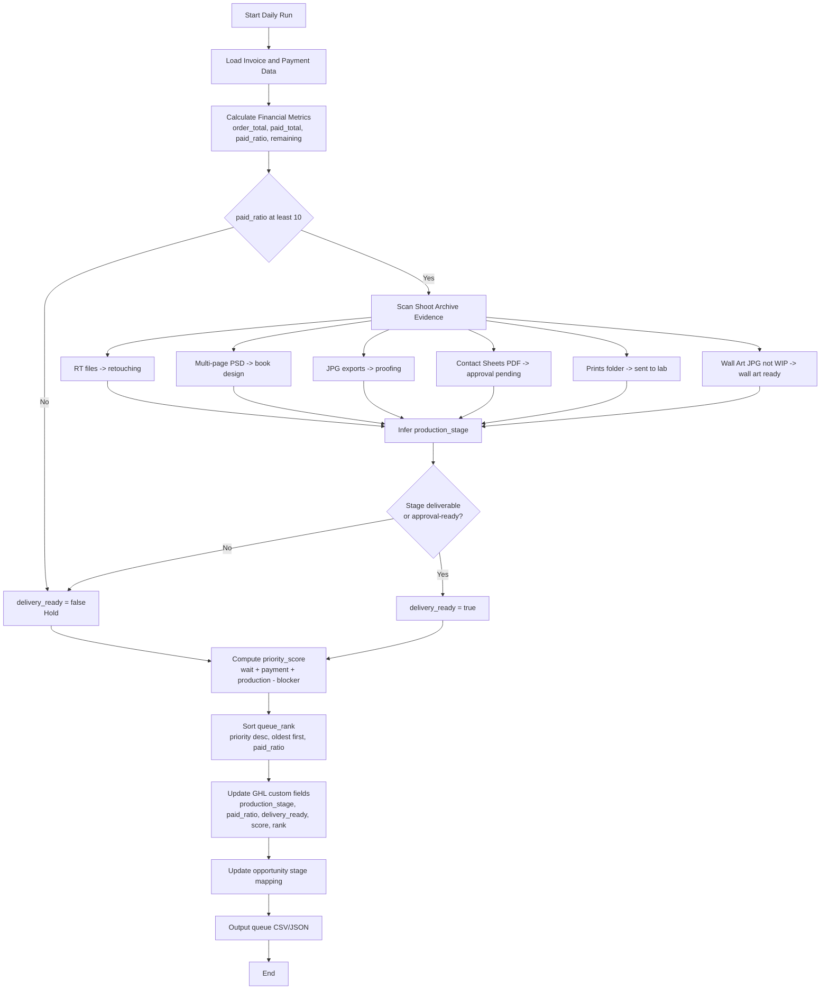

website if it has been ordered
# GHL Production Priority Pipeline Proposal

## Purpose
Create a single production queue in GoHighLevel that answers:
- Has this client paid enough to release work?
- Where is this order in production?
- Which client should be handled first?

This extends the current SideKick sync flow so production and delivery decisions are visible at a glance.

## Investigation Summary (What Already Exists)

### Already implemented
- SideKick_PS sync updates GHL contact custom fields for shoot/job number, shoot status, and shoot date.
- SideKick_PS sync creates and updates GHL invoices with payment records.
- SideKick_PS sync can add tags to contact and to all related opportunities.
- SideKick_PS roadmap already defines a target opportunity stage model:
	- Lead -> Booked -> Shoot Complete -> Editing -> Proofing -> Ordered -> Delivered

### Not implemented yet
- No production-priority score that ranks clients by wait time and payment sufficiency.
- No unified delivery gate rule in code that blocks/recommends release based on paid percentage plus production stage.
- No dedicated markdown proposal in workspace for production queue operations (this document fills that gap).

## High-Level Pipeline

### Pipeline Flowchart

### 1) Financial Readiness
Calculate for each order:
- total_order_value
- total_paid_to_date
- payments_count
- paid_ratio_percent = (total_paid_to_date / total_order_value) * 100
- amount_remaining = total_order_value - total_paid_to_date

Delivery threshold:
- Hold: paid_ratio_percent < 10
- Eligible band: paid_ratio_percent >= 10 and <= 20
- Comfortable: paid_ratio_percent > 20

### 2) Production Evidence (Folder-driven)
Use existing folder/file signals:
- Retouching started:
	- files found in processed/RT
- Book design started:
	- PSD files with page numbers beyond page 1
- Book compiled:
	- JPG folder exists with matching page JPEG exports
- Book design finished and sent for approval:
	- Contact Sheets PDF exists
- Prints uploaded to lab:
	- files in Prints folder
- Wall art produced:
	- JPEG files in Wall Art excluding WIP

### 3) Delivery Gate
Set delivery_ready = true only when both are true:
- paid_ratio_percent >= 10
- production stage is deliverable or client-approval-ready

If either fails, delivery_ready = false.

## Production Priority Queue

## Priority Goal
Highest priority should be clients who:
- have waited longest
- have paid enough
- are closest to delivery-ready

## Priority Score (0 to 100)
Compute daily:

- wait_score (0-40): based on days since order date
- payment_score (0-30):
	- 0 if paid_ratio_percent < 10
	- 15 if 10-19.99
	- 30 if >= 20
- production_score (0-25):
	- 5 retouching
	- 10 book design started
	- 15 book compiled
	- 20 approval pending
	- 25 lab-ready or upload-ready
- approval_blocker_penalty (0 to -10):
	- -10 if waiting for client approval beyond SLA

Formula:
priority_score = wait_score + payment_score + production_score + approval_blocker_penalty

Tie-breakers:
1. Older order date first
2. Higher paid_ratio_percent
3. Higher total_order_value

## GHL Data Model (Proposed Additions)
Add custom fields for visibility and automation:
- production_stage
- production_last_seen_at
- paid_total
- paid_ratio_percent
- payments_count
- amount_remaining
- delivery_ready (yes/no)
- priority_score
- queue_rank

Live custom field IDs (created in GHL):
- supplier_lookup_key = wkTXb05XhNmvkv15CJ2A
- supplier_last_checked_at = StwyIJSe6fSoDBiwFzRb
- supplier_check_result = Dx2Ozn6kqcoWjbbjvP8D
- supplier_overall_status = ZBpb5bapGO8ub5oDWvXA
- book_supplier = NS51Mz3NQCXDhdgfG466
- book_status = DJGlawxQWPtKQmqwXHYS
- book_tracking_ref = jXNH0a63HNetvfEX6PNe
- book_ordered_at = QjYEvvsWkNZXlMnhFpGL
- wall_art_supplier = hmcZ1eSzFvJiyv6CzMqd
- wall_art_status = Ma40ety3AwJFODsQmuK1
- wall_art_tracking_ref = yXDpwSD5ghwsL77cKuNw
- wall_art_ordered_at = IkfM9eDxEDTdG7C5tGU1

Keep using existing fields already in SideKick:
- session_job_no
- session_status
- session_date

## Opportunity Stage Mapping (Proposed)
Map production evidence to opportunity stage updates:
- processed/RT present -> Editing
- multi-page PSD present -> Editing / Book Design
- JPG exports present -> Proofing
- Contact Sheets PDF present -> Awaiting Approval
- Prints folder non-empty -> Ordered / Sent To Lab
- Wall Art JPEG outside WIP -> Ordered / Wall Art Ready
- delivered flag true -> Delivered

## Operating Cadence
Daily run (or twice daily):
1. Pull payment facts from invoice/payment lines.
2. Scan production folders and infer production_stage.
3. Recalculate delivery_ready and priority_score.
4. Update GHL fields and opportunity stage.
5. Build queue_rank sorted by priority_score desc, then tie-breakers.

Weekly review:
- audit records in Hold with high production_score but low payment_score
- identify long-wait clients not moving stages
- confirm stale awaiting approval opportunities

## MVP Rollout Plan
Phase 1:
- Add fields: paid_total, paid_ratio_percent, delivery_ready, priority_score
- Build queue output CSV/JSON from current data sources

Phase 2:
- Add production folder scanner to infer production_stage
- Push production_stage and queue_rank to GHL custom fields

Phase 3:
- Auto-move opportunity stages from production evidence
- Add workflow alerts:
	- delivery_ready turned true
	- waiting for approval over SLA
	- high wait_score but low payment

## Acceptance Criteria
- Every active order has paid_ratio_percent and priority_score.
- Queue can be sorted by priority_score and trusted for daily production decisions.
- Delivery decisions are consistent with the 10 percent threshold rule.
- Opportunity stage reflects real production evidence.